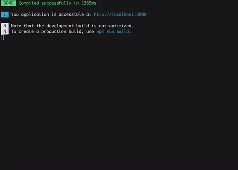

## 前端进阶知识点
1. [惰性求值](https://zhuanlan.zhihu.com/p/26535479)
2. curry 化
3. 闭包
4. 高阶函数
5. 函数式编程
6. compose
7. 中间件
8. 依赖注入
9. flex和grid
10. 框架类库源码分析
11. [精读《Vue3.0 Function API》](https://zhuanlan.zhihu.com/p/71667382)
12. [精读《Function Component 入门》](https://zhuanlan.zhihu.com/p/67087685)
13. [一篇看懂 React Hooks](https://zhuanlan.zhihu.com/p/50597236)， [精读《React Hooks 最佳实践》](https://zhuanlan.zhihu.com/p/81752821)
14. promise, generator, async await
15. 数据结构与算法

## 技术博客
- [倔金腾讯IVWEB团队](https://juejin.im/user/5a9f77666fb9a028c14a01eb)
- [知乎purerender](https://zhuanlan.zhihu.com/purerender)
- [知乎精读前端](https://zhuanlan.zhihu.com/FrontendPerusal)

## 工具类及工程化类
- gitlab
- jinkens
- webpack
- react react-router react-redux mobx
- 装饰器

## 目录说明
- algorithm
- java
- nodejs
- python
- vue
- react

## 片段

```javascript
console.log('abc')
```

```
片段
```
## 引用资源


## 表格
### 测试表格
| a | b |
| --- | --- |
| a | b |
| a | b |
### 测试表格2
|Name|Priority|Help needed|
|---|---|---|
|[Language Spec](https://github.com/LingDong-/wenyan-lang/issues/1)|  ***** |  |
|[Class](https://github.com/LingDong-/wenyan-lang/issues/31) / [Object literals](https://github.com/LingDong-/wenyan-lang/issues/20) |  *** | |
|[Import statements](https://github.com/LingDong-/wenyan-lang/issues/100) |  *** | |
|Standard library ([Math](https://github.com/LingDong-/wenyan-lang/issues/55)/[Bitwise ops](https://github.com/LingDong-/wenyan-lang/issues/2)/[Random](https://github.com/LingDong-/wenyan-lang/issues/87)) |  ***** | |
|[Test suite](https://github.com/LingDong-/wenyan-lang/issues/38)|  **** | √  |
|[Switch statements](https://github.com/LingDong-/wenyan-lang/issues/53)|  *** | |
|[Functional programming](https://github.com/LingDong-/wenyan-lang/issues/99) |  *** | |
|Stricter compiler |  **** | |
|Compiler for other languages |  ** | √ |
|[Plugins for editors](https://github.com/LingDong-/wenyan-lang/issues/77) |  ** | √ |
|Convert [js](https://github.com/LingDong-/wenyan-lang/issues/47)/[py](https://github.com/LingDong-/wenyan-lang/issues/67)/[anything](https://github.com/LingDong-/wenyan-lang/issues/73) back to wenyan |  * | √ |
|[Escaping](https://github.com/LingDong-/wenyan-lang/issues/84)/[generating](https://github.com/LingDong-/wenyan-lang/issues/128) special characters |  *** | |
|[Alternative syntax for 「「」」](https://github.com/LingDong-/wenyan-lang/issues/81)|  ** | |
|[Alternative symbols for 。](https://github.com/LingDong-/wenyan-lang/issues/93)|  ** | |
|Online IDE [fonts](https://github.com/LingDong-/wenyan-lang/issues/5) and [vertical text](https://github.com/LingDong-/wenyan-lang/issues/9) |  ** | |
|[Rendering comment as small inline text](https://github.com/LingDong-/wenyan-lang/issues/148) | ** | |
|More examples | ** | √ |


> **版权声明**
>
> 转载时也必须遵循创意共享的惯例，注明文章的作者和出处（即本页面或文章页面）
>
> 谢谢合作！